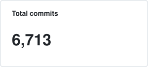
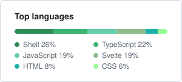
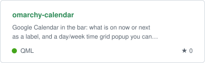
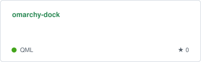
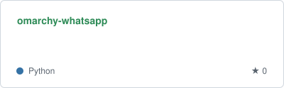
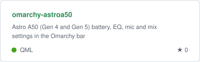
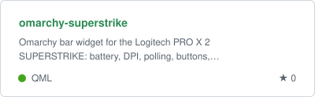
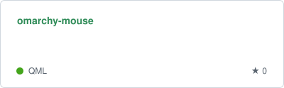
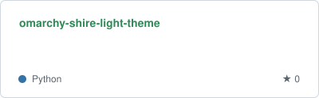
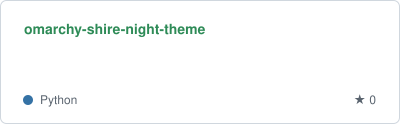

  

  Hello, my name is Leonavas and I am Head of Engineering at Febrafar, where I lead multiple teams and am technically responsible for all of Febrafar's products.

  
  

<h3 align="center" style="font-size: 18px; margin-top: 30px;">Stats</h3>

  
  

<h3 align="center" style="font-size: 18px; margin-top: 30px;">Omarchy Plugins</h3>

  
  
  
  
  
  

<h3 align="center" style="font-size: 18px; margin-top: 30px;">Omarchy Themes</h3>

  
  

  

    Crafted with ☕
  

